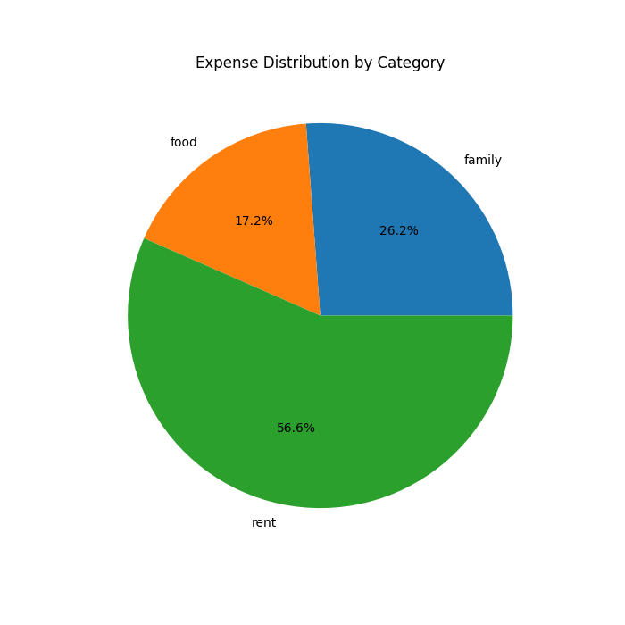

# Personal Finance Manager 💰  
A Python-based application that helps users track, categorize, and visualize their financial transactions, empowering better financial planning and decision-making.  

## Features 🚀  
- **Transaction Tracking**: Easily log your income and expenses manually.  
- **Categorization**: Assign custom categories to transactions for detailed insights.  
- **Financial Summary**: Real-time computation of total income, expenses, and net balance.  
- **Data Visualization**: Generate pie charts to visualize spending patterns and analyze financial habits.  

## Technologies Used 🛠  
- **Python**: Core logic and operations.  
- **Pandas**: Data handling and processing.  
- **Matplotlib**: Data visualization and chart generation.  

## How It Works 📋  
1. **Log Transactions**: Input income and expenses with categories and descriptions.  
2. **View Summary**: Get a real-time overview of your financial health.  
3. **Visualize Data**: Analyze spending patterns with intuitive pie charts.  

## Installation 🖥  
1. Clone this repository:  
   ```bash  
   git clone https://github.com/yourusername/Personal-Finance-Manager.git  
## Navigate to the Project Directory 📂
To navigate to the project directory, run the following command:
```bash
cd Personal-Finance-Manager
```

## Install Dependencies 📥
To install the required dependencies, use:
```bash
pip install pandas matplotlib
```

## Run the Application ▶️
To start the application, execute:
```bash
python personal_finance_manager.py
```

# Screenshots 📸
  
*Sample visualization of expense categories.*

# Future Improvements 🛠
- Integrate CSV/Excel export for transaction data.  
- Add automatic bank transaction imports via APIs.  
- Include budgeting and financial goal-setting features to enhance usability.  

# Contributing 🤝
Contributions are welcome! Feel free to open issues or submit pull requests to improve the project.  

# Acknowledgments 🙌
- Inspired by the need for simple and effective personal finance management tools.  
- Thanks to the open-source community for continuous inspiration and learning.  
